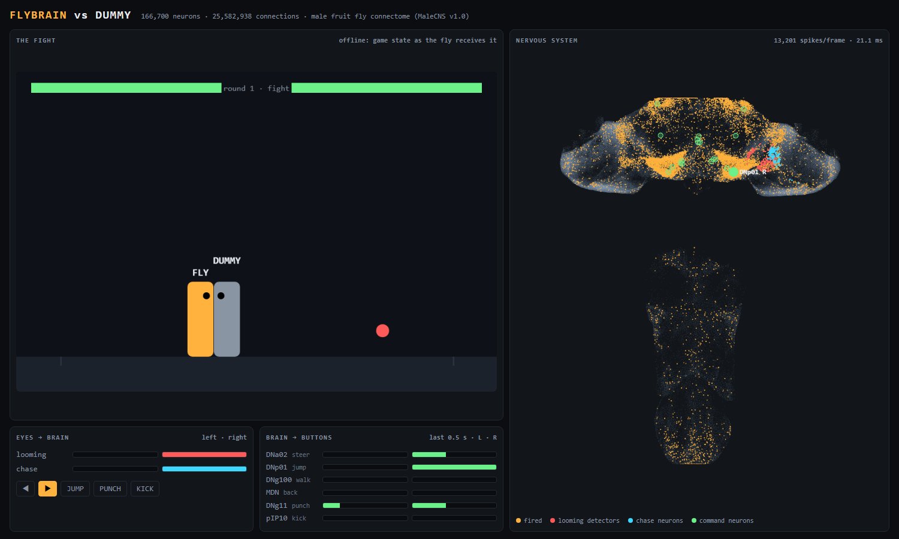

# FLYBRAIN: a fruit fly's nervous system plays a fighting game

<!-- To get an inline player on GitHub: edit this README on github.com, drag video.mp4 into
     the editor, and replace the link below with the URL GitHub generates. -->
**▶ [Watch the demo (video.mp4)](video.mp4)**

FLYBRAIN is a simulation of the **complete central nervous system of an adult male fruit fly**
(*Drosophila melanogaster*): **166,700 neurons and 25.6 million connections** from the
[MaleCNS v1.0 connectome](https://male-cns.janelia.org). It plays
[SSH Fighter](https://sshfighter.com), an online terminal fighting game, as a registered bot.

There is **no training, no reward and no learned policy**. The wiring comes from electron microscopy
of a real fly brain. The game only touches the network at a few neuron types known from the
literature to detect things and to issue movement commands. Everything in between is the connectome.

It loses almost every match. It does chase its opponent, though, and the reason it chases turns
out to be real fly biology.



## How it works

```
game state (30 Hz)
  └─> "eyes": opponent + projectiles as objects on the fly's left / right
        └─> LC4, LPLC2 (looming detectors)   LC10a (object tracking, used by males to chase)
              └─> 166,700-neuron connectome, leaky integrate-and-fire, 50 steps/s
                    └─> descending neurons (the brain's commands to the body)
                          └─> buttons: move, jump, punch, kick
```

| Readout neuron | What it does in a real fly | What it does in the game |
|---|---|---|
| DNa02, left vs right | steering while walking | walk left / right |
| DNp01 (giant fiber) | escape take-off from looming objects | jump |
| DNg100 | forward walking (as in Fly64) | walk forward |
| MDN ("moonwalker") | backward walking | back off (= block) |
| DNg11 | nothing to do with fighting (arbitrary choice) | punch |
| pIP10 | courtship song | kick |

* **Network** (`build_brain.py`, `fly_brain.py`): every neuron with a MaleCNS superclass
  annotation, and every connection between them. The weight is the synapse count, made negative
  when the presynaptic neuron's predicted transmitter is GABA, glutamate or histamine, then scaled
  so each neuron's inputs add up to 1. Each neuron is a simple leaky integrate-and-fire unit
  (`v ← e^(-dt/τ)·v + gain·W·spikes + tonic + noise`; it spikes and resets at 1). This recipe
  follows [Fly64](https://github.com/ornata/fly).
* **Eyes** (`fly_eyes.py`): the game state is turned into objects to the fly's left or right. An
  approaching object drives the fly's own looming detectors on that side. The opponent drives
  that side's LC10a neurons more strongly the closer it is.
* **Decoder** (`fly_fighter.py`): counts spikes of the readout neurons in short windows. These
  thresholds are hand-picked, and they are the only hand-tuned part between the brain and the
  buttons.
* **Dashboard** (`fly_dashboard.py`, `dashboard.html`): shows the live match next to all
  140,638 neurons that have a measured position. Each dot flashes when its neuron fires.

## What we found

These are small experiments, run on a desktop. They are not peer-reviewed science.

1. **With Fly64's settings, vision does nothing.** Fly64 uses tonic 0.18 and decay e^(-0.2).
   That puts every neuron's resting voltage at 0.18 / (1 − 0.82) ≈ 1.0, exactly the firing
   threshold. The whole network ticks along by itself at about 4 Hz, and the motor neurons fire
   at the same rate whatever the fly is shown (`experiment.py`).
2. **The signal from the photoreceptors dies at the first relay.** Photoreceptors release
   histamine, which is inhibitory, onto lamina neurons. Real lamina neurons use smooth, graded
   signals rather than spikes, which this simple model can't reproduce. In every setting we
   tried, looming stimuli never reached the looming detectors (`sweep.py`).
3. **Past the eye, the wiring does the right thing on the correct side** (`inject.py`,
   tonic 0.14 and gain 3.0, 6 noise seeds):

   | Stimulate (left side only) | Result |
   |---|---|
   | LC4 + LPLC2 looming detectors | left giant fiber DNp01 **+17 to +25 spikes/s**; right side unchanged |
   | LC10a courtship-tracking neurons | left DNa02 steering neuron **+1.4 to +3.7 spikes/s**; right side unchanged |

   None of the other readout neurons changed. These are the known looming → escape and
   courtship pursuit → steering pathways, and they come out of the wiring alone.
4. **In a closed loop, it chases.** Against a scripted dummy for 90 s, **64%** of its moves went
   toward the opponent, where chance is 50%.
5. **It doesn't dodge.** 22% of its jumps happened while a projectile was nearby, against 20% by
   chance. It jumps when the opponent rushes in, not at shots.
6. **Live record:** 0 wins, 6 losses against other bots when this was written. It dealt 311
   damage, took 1,200 and landed 40 hits. Punches and kicks come only from background noise.
   Current record: [sshfighter.com/players/FLYBRAIN](https://sshfighter.com/players/FLYBRAIN).

### Limitations

* Point neurons with one global set of parameters. There are no dendrites, no graded neurons,
  no neuromodulators and no plasticity.
* Transmitter sign is a rough rule (GABA, glutamate and histamine inhibitory; everything else
  excitatory). Real effects depend on the receptor.
* The visual front end is a shortcut, like [Eon's embodied fly](https://eon.systems/updates/embodied-brain-emulation).
  We inject input into LC4, LPLC2 and LC10a instead of simulating the eye.
* The game buttons and decoder thresholds were chosen by hand. Flies can't punch.
* None of this is validated against recordings from real flies. It's a demo, not an emulation.

## Run it

Requires Python 3.12+ and about 1.5 GB of disk. A multi-core CPU helps: one brain step takes
about 12–15 ms on 24 threads, and real time needs under 20 ms.

```sh
python -m venv .venv
# Windows: .venv\Scripts\activate    macOS/Linux: source .venv/bin/activate
pip install -r requirements.txt

python build_brain.py          # downloads MaleCNS v1.0 (~1.1 GB) to ~/fly-data and builds the network
python fly_fighter.py --offline --seconds 120 --dashboard     # fake opponent, opens http://127.0.0.1:8777
```

Set `FLY_DATA=/some/path` to store the data somewhere else.

### Getting the data (the "model")

There are no trained weights to download. The "model" is the fly's wiring diagram, and
`build_brain.py` builds it from the public MaleCNS v1.0 release. It downloads these files into
`$FLY_DATA/raw/` and skips any that are already there. An interrupted download starts over on
the next run:

| File | Size | What it is | Source |
|---|---|---|---|
| `connectome-weights-male-cns-v1.0-minconf-0.5.feather` | 1.05 GB | every neuron-to-neuron connection, with synapse counts | [MaleCNS bucket](https://storage.googleapis.com/flyem-male-cns/v1.0/connectome-data/flat-connectome/connectome-weights-male-cns-v1.0-minconf-0.5.feather) |
| `body-annotations-male-cns-v1.0-minconf-0.5.feather` | 14 MB | cell types, sides, classes, soma positions | [MaleCNS bucket](https://storage.googleapis.com/flyem-male-cns/v1.0/connectome-data/flat-connectome/body-annotations-male-cns-v1.0-minconf-0.5.feather) |
| `body-neurotransmitters-male-cns-v1.0.feather` | 43 MB | predicted neurotransmitter for each neuron | [MaleCNS bucket](https://storage.googleapis.com/flyem-male-cns/v1.0/connectome-data/flat-connectome/body-neurotransmitters-male-cns-v1.0.feather) |
| `optic-columns.xlsx` | 0.1 MB | which eye column each photoreceptor belongs to | [flyconnectome/2025malecns](https://github.com/flyconnectome/2025malecns/blob/67767d2233657983993ff6c2be48e836a935863c/supplemental_data/optic-column-type-assignments-v1.0.xlsx) |

To download by hand instead (for example on a slow connection, or with `curl -C -` to resume):

```sh
mkdir -p ~/fly-data/raw && cd ~/fly-data/raw
B=https://storage.googleapis.com/flyem-male-cns/v1.0/connectome-data/flat-connectome
curl -LO -C - $B/connectome-weights-male-cns-v1.0-minconf-0.5.feather
curl -LO -C - $B/body-annotations-male-cns-v1.0-minconf-0.5.feather
curl -LO -C - $B/body-neurotransmitters-male-cns-v1.0.feather
curl -L -o optic-columns.xlsx https://raw.githubusercontent.com/flyconnectome/2025malecns/67767d2233657983993ff6c2be48e836a935863c/supplemental_data/optic-column-type-assignments-v1.0.xlsx
```

Then `python build_brain.py` builds the network in about a minute. It writes
`weights.npz` (205 MB, the signed and normalized connection matrix) and `brain.npz` (neuron
types, sides, positions, readout groups, eye layout) into `$FLY_DATA`. Expect exactly
**166,700 neurons and 25,582,938 connections**. If you get different numbers, the data changed.

**Other ways to explore the same data**, without downloading anything:

* [neuPrint](https://neuprint.janelia.org) (dataset `male-cns:v1.0`): look up any neuron's inputs and
  outputs in the browser, for example `DNp01`, the jump neuron. Its top inputs are LC4 and LPLC2.
  For code, use `pip install neuprint-python` with an API token from your neuPrint account page.
* The [MaleCNS site](https://male-cns.janelia.org): cell type and dimorphism explorers, 3D viewers,
  and the full download list (synapse positions, skeletons, EM images; far larger and not needed
  here).

**Playing online.** Give the bot its own SSH key and name:

```sh
ssh-keygen -t ed25519 -f ~/.ssh/sshfighter-mybot -N ''
ssh -i ~/.ssh/sshfighter-mybot -o IdentitiesOnly=yes MYBOT@sshfighter.com   # press Enter, type the name, Enter, quit
python fly_fighter.py --user MYBOT --identity ~/.ssh/sshfighter-mybot --opponents bots --matches 3 --dashboard
```

The server labels bots automatically. Please keep `--opponents bots` unless people actually want
to fight a fly.

**Experiments:** `python experiment.py`, `python sweep.py`, `python inject.py`.

## Files

| File | What it does |
|---|---|
| `build_brain.py` | downloads MaleCNS v1.0 and builds the weight matrix, readout groups, eye layout and neuron positions |
| `fly_brain.py` | integrate-and-fire simulation (numba, multi-threaded) |
| `fly_eyes.py` | photoreceptor rendering plus the looming/chase feature-detector input |
| `fly_fighter.py` | game loop, decoder, offline dummy, SSH Fighter bot protocol |
| `fly_dashboard.py`, `dashboard.html` | live dashboard (Server-Sent Events, no extra dependencies) |
| `experiment.py`, `sweep.py`, `inject.py` | the experiments above |

## Credits

* **Connectome:** MaleCNS v1.0 by FlyEM (HHMI Janelia), the University of Cambridge, the MRC
  Laboratory of Molecular Biology and Google Research. Data used under
  [CC BY 4.0](https://male-cns.janelia.org/download/).
* **[Fly64](https://github.com/ornata/fly)** by Jessica Paquette, who got the MaleCNS brain
  to play Super Mario 64. The neuron model, weight normalization and optic-column handling here
  are adapted from it.
* **[SSH Fighter](https://sshfighter.com)** by Thomas Davis
  ([source](https://github.com/thomasdavis/sshfighter.com)), including its bot API.
* **[Eon Systems](https://eon.systems/updates/embodied-brain-emulation)**, for the idea of
  feeding a visual front end into an embodied connectome.
* Written with [Claude Code](https://claude.com/claude-code).

## References

1. Berg, S. et al. (2026). Sexual dimorphism in the complete connectome of the *Drosophila* male central nervous system. *Cell*. Data: [male-cns.janelia.org](https://male-cns.janelia.org)
2. Google Research (2026). [A connectomics milestone: mapping the complete male fruit fly brain](https://research.google/blog/a-connectomics-milestone-mapping-the-complete-male-fruit-fly-brain/)
3. flyconnectome/2025malecns: [optic column type assignments v1.0](https://github.com/flyconnectome/2025malecns)
4. Plaza, S. M. et al. (2022). neuPrint: an open access tool for EM connectomics. *Frontiers in Neuroinformatics* 16.
5. Dorkenwald, S. et al. (2024). Neuronal wiring diagram of an adult brain. *Nature* 634.
6. Shiu, P. K. et al. (2024). A *Drosophila* computational brain model reveals sensorimotor processing. *Nature* 634.
7. Wang-Chen, S. et al. (2024). NeuroMechFly v2: simulating embodied sensorimotor control in adult *Drosophila*. *Nature Methods* 21, 2353–2362.
8. von Reyn, C. R. et al. (2014). A spike-timing mechanism for action selection. *Nature Neuroscience* 17, 962–970.
9. Ache, J. M. et al. (2019). Neural basis for looming size and velocity encoding in the *Drosophila* giant fiber escape pathway. *Current Biology* 29, 1073–1081.
10. Ribeiro, I. M. A. et al. (2018). Visual projection neurons mediating directed courtship in *Drosophila*. *Cell* 174, 607–621.
11. Rayshubskiy, A. et al. (2020). Neural control of steering in walking *Drosophila*. *bioRxiv*.
12. Bidaye, S. S. et al. (2014). Neuronal control of *Drosophila* walking direction. *Science* 344, 97–101.
13. von Philipsborn, A. C. et al. (2011). Neuronal control of *Drosophila* courtship song. *Neuron* 69, 509–522.
14. Paquette, J. (2026). [Fly64: a fly brain model plays Super Mario 64](https://github.com/ornata/fly).
15. Eon Systems (2026). [How the Eon team produced a virtual embodied fly](https://eon.systems/updates/embodied-brain-emulation).

If you use the connectome data, cite reference 1 and follow the
[MaleCNS attribution terms](https://male-cns.janelia.org/download/).
